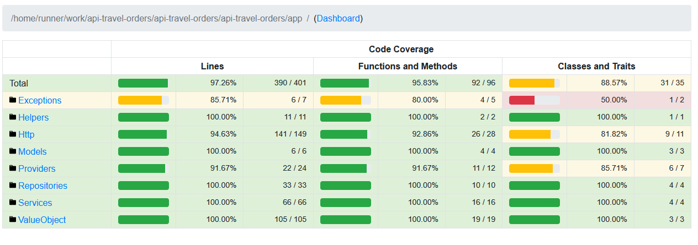
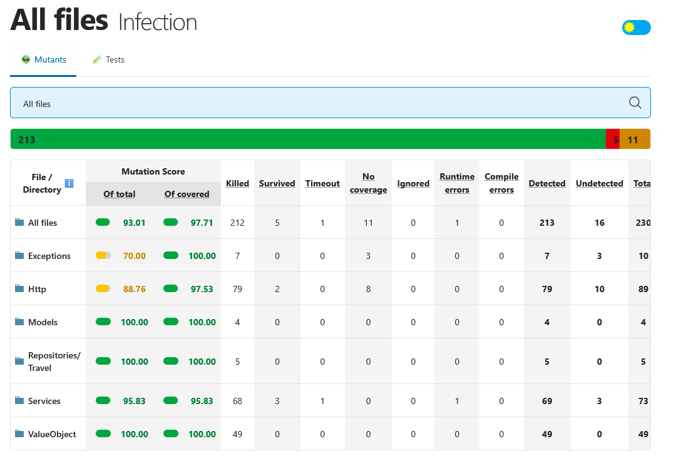
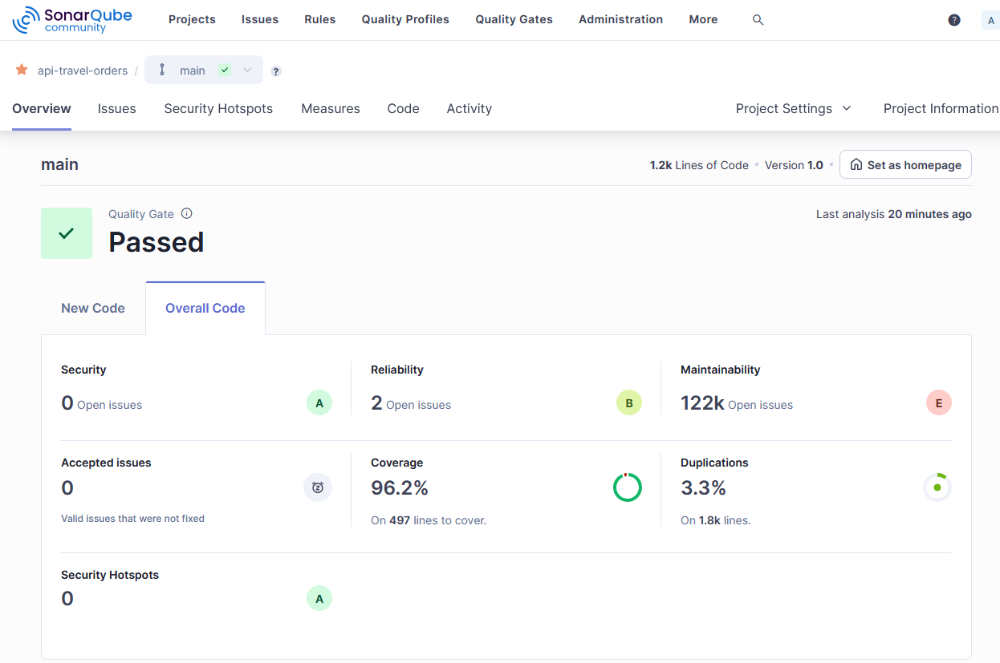

# Travel Order API

A Travel Order API permite gerenciar e controlar solicitações de viagem, com funcionalidades para listar, criar, recuperar e atualizar informações das ordens de viagem.

## Requisitos

- [Docker](https://docs.docker.com/compose/install/) e [Docker Composer](https://docs.docker.com/compose/install/standalone/)

## Rodando localmente

### Clone o projeto

```bash
git clone https://github.com/Edilsonss123/travel-order.git travel-order
```

### Entre no diretório do projeto

```bash
cd travel-order
```

### Configure o arquivo `.env`

Entre no diretório `api-travel-orders` e configure o arquivo `.env`, utilizando o `.env.example` como modelo, substituindo a configuração de conexão com o banco de dados:

```bash
cd travel-order/api-travel-orders

DB_CONNECTION=mysql
DB_HOST=db-travel-orders
DB_PORT=3306
DB_DATABASE=travel-orders
DB_USERNAME=travel-user
DB_PASSWORD="8teste0rd&"
```

### Torne o script de inicialização executável

Antes de iniciar o container, será necessário tornar o script de inicialização da aplicação executável:

```bash
chmod +x travel-order/data/api/entrypoint.sh
```

O bash executa os comandos abaixo, com um `sleep` para garantir que o banco de dados já estará disponível:

```bash
# Rodar composer install
echo "Instalando dependências do Composer..."
composer install --no-interaction --prefer-dist

# Gerar a chave JWT e APP_KEY (se necessário)
echo "Gerando chave JWT & APP_KEY..."
php artisan key:generate --no-interaction
php artisan jwt:secret --no-interaction

# Rodar as migrations do banco de dados
echo "Rodando as migrations..."
php artisan migrate --no-interaction --force

# Rodar os seeders (se necessário)
echo "Rodando os seeders..."
php artisan db:seed --no-interaction

# Limpar cache de configuração, rotas e views
echo "Limpando cache de configuração, rotas e views..."
php artisan config:clear
php artisan route:clear
php artisan view:clear

# Iniciar o servidor Laravel
echo "Iniciando o servidor Laravel..."
php artisan serve --host 0.0.0.0 --port 8000
```

### Inicie o contêiner com o Docker

No primeiro momento, vai demorar um pouco quando executado pela primeira vez:

```bash
docker-compose up -d
```

### Executando os testes

Para executar os testes, será necessário estar dentro do container. Siga o passo a passo:

```bash
docker exec -it api-travel-orders /bin/bash
cd api-travel-orders
php artisan test ou ./vendor/bin/phpunit
```

#### Tipos de testes

- **Teste Unitário**:
    ```bash
    php artisan test --filter Unit
    ```

- **Teste de Integração**:
    ```bash
    php artisan test --filter Feature
    ```

- **Gerar cobertura de teste**:
    ```bash
    php artisan test:coverage
    ```

- **Gerar cobertura de teste de mutação**:
    ```bash
    php artisan test:mutation
    ```

### Acessando os resultados

Para acessar os resultados da cobertura de teste e teste de mutação, você pode consultar os relatórios servidos pelo Nginx localmente:

- [Coverage](http://localhost:2052/)
- [Mutation](http://localhost:2052/mutation/)

### Publicação de resultados no GitHub Pages

Agora, os resultados dos testes de mutação e cobertura são publicados automaticamente no GitHub Pages. Acesse os relatórios diretamente nas seguintes URLs:

- [Cobertura de Teste](https://edilsonss123.github.io/api-travel-orders/coverage/)

- [Cobertura de Mutação](https://edilsonss123.github.io/api-travel-orders/mutation/)



Ao iniciar o container, as dependências, migrations e seeders serão invocados automaticamente através do script bash, que tem como última ação subir a aplicação na porta 8000 do container, mapeada para a rede host na porta 2050.

# Análise de Código com SonarQube

Este projeto utiliza o **SonarQube** para análise de qualidade do código. A seguir, estão as instruções para configurar e executar a análise.!


## Configuração do SonarQube com Docker

O SonarQube e o banco de dados PostgreSQL são executados via **Docker Compose**. O arquivo `docker-compose-sonar.yml` define os serviços necessários:

```yaml
docker-compose -f docker-compose-sonar.yml up -d
```

Isso iniciará os contêineres:
- **sonarqube**: Interface do SonarQube acessível em `http://localhost:9000`.
- **sonarqube-db**: Banco de dados PostgreSQL para armazenar os resultados da análise.

## Arquivo de Configuração: `sonar-project.properties`

O arquivo `sonar-project.properties` contém as configurações do projeto para análise

## Gerar artefatos analise cobertura de teste
```bash
php artisan test:sonar
```

## Executando a Análise com o SonarScanner

Para executar a análise do código, utilize o seguinte comando com o **SonarScanner CLI**:

```sh
docker run   --rm   --network=host   -v "./api-travel-orders:/usr/src"   sonarsource/sonar-scanner-cli   -Dsonar.token={TOKEN}   -Dsonar.scanner.force-deprecated-clean=true
```

### Notas:
- Substitua `{TOKEN}` pelo seu token de autenticação do SonarQube.
- Certifique-se de que os contêineres do SonarQube e do banco de dados estão em execução antes de iniciar a análise.
- O resultado da análise pode ser acessado via `http://localhost:9000`.


### Acessando o serviço da API

Acesse a API através da porta 2050 do localhost:

```bash
https://localhost:2050/
```

## Stack utilizada

- **Ambiente de desenvolvimento**: Docker
- **Abordagem arquitetônica**: Microsserviço
- **Back-end**: Laravel
    - Inversão de dependência
    - Repositório para acesso à camada de dados
    - Revisionable para revisão de alterações através dos logs gravados
- **Testes**:
    - Testes unitários com PHPUnit
    - Testes de integração com PHPUnit
    - Testes de mutação com Infection
    - Relatório de cobertura de testes - Coverage
    - Relatório de cobertura de mutação - Infection
- **Autenticação**: JWT
- **Banco de Dados**: MySQL

## Funcionalidades da API

### Viagem:

- Lista de status
- Lista de solicitações de viagem
- Lista de uma solicitação
- Solicitação de uma nova viagem
- Atualização de status de uma solicitação de viagem

### Autenticação:

- Criação de usuário
- Geração do token de acesso do usuário
- Invalidação do token de acesso do usuário

### Health:

- Verificação de status da API
- Teste de carga (load generate)

### Usuário padrão:

- **Email**: `travel-order-test-2024@gmail.com`
- **Senha**: `travel-order-test-2024`

### Documentação da API

Para acessar a documentação completa da API, consulte a [documentação Postman](https://documenter.getpostman.com/view/5807678/2sAY52dKUX).